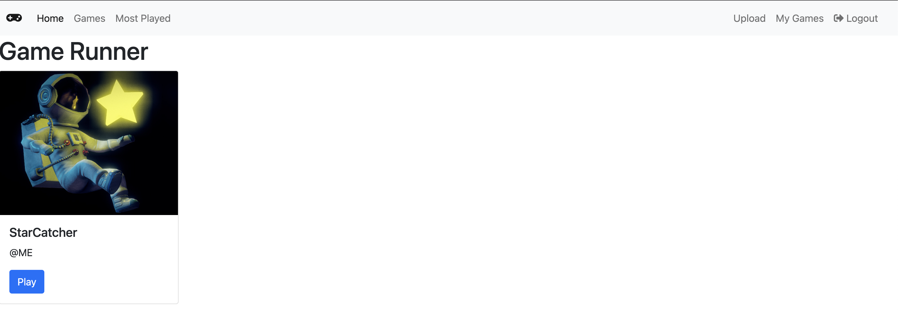

# Game Runner

A simple Flask application to upload and play [smarphone-connector](https://github.com/lebalz/smartphone-connector)/[socketio_server](https://github.com/lebalz/socketio_server) games written in python.



The uploaded games could have potentially unsave code - thats why the code is executed as an unprivileged user _game_runner_ with read-only access.

Whenever a python-file is added to `./running_games` (e.g. `game-1234.py`), [inotifywait](https://linux.die.net/man/1/inotifywait) starts the python script as the user _game_runner_ in a background process. When a file `name.kill` (e.g. `game-1234.kill`) is added, the previously started process is killed.

## Development

### New Migration

Since the `startup()` method should not be called on migrations, touch first the File `.skip_setup`

```sh
touch .skip_setup && flask db migrate
```

apply migration

```sh
touch .skip_setup && flask db upgrade
```

## [Dokku](http://dokku.viewdocs.io/dokku/) Deployment

- inotifywait is installed during the predeploy stage, @see [app.json](app.json)
- the inotify configuration can be found in [on_game_state_change.sh](on_game_state_change.sh)
- ... and is started as a background task during the startup of the flask app through the [Procfile](Procfile)

### Prerequirements

```sh
dokku plugin:install https://github.com/dokku/dokku-postgres.git postgres
dokku plugin:install https://github.com/dokku/dokku-letsencrypt.git
```

### Setup

Important ENV Variables:

- `MAX_CONCURRENT_PLAYS` defines how many concurrent plays can be processed by the server. This highly depends on the power of your server.

```sh
dokku apps:create game-runner
dokku domains:add game-runner "your.domain.com"
dokku config:set --no-restart game-runner APP_SETTINGS=config.ProductionConfig
dokku config:set --no-restart game-runner MAX_CONCURRENT_PLAYS=15
dokku config:set --no-restart game-runner HOST_URL=https://game.foo.ch

# enable upload sizes up to 20mb
mkdir /home/dokku/game-runner/nginx.conf.d
chown -R dokku:dokku /home/dokku/game-runner/nginx.conf.d/
echo 'client_max_body_size 20m;' > /home/dokku/game-runner/nginx.conf.d/upload.conf
chown dokku:dokku /home/dokku/game-runner/nginx.conf.d/upload.conf
service nginx reload

# create db
dokku postgres:create game-runner
dokku postgres:link game-runner game-runner

# create persistent storage folders
mkdir -p  /var/lib/dokku/data/storage/game-runner/uploads
chown -R 32767:32767 /var/lib/dokku/data/storage/game-runner/uploads
mkdir -p  /var/lib/dokku/data/storage/game-runner/previews
chown -R 32767:32767 /var/lib/dokku/data/storage/game-runner/previews

dokku storage:mount game-runner /var/lib/dokku/data/storage/game-runner/uploads:/app/uploads
dokku storage:mount game-runner /var/lib/dokku/data/storage/game-runner/previews:/app/static/previews
```

setup all your env's with `nano nano /home/dokku/game-runner/ENV`

### Initial Deploy

```sh
git remote add dokku dokku@<your-ip>:game-runner
git push dokku main:master
```

### Letsencrypt

Make sure:

- you have set a domain and your page is reachable
- no pagerules with permanent redirects e.g. from Cloudflare exists

```sh
dokku config:set --no-restart game-runner DOKKU_LETSENCRYPT_EMAIL=lebalz@outlook.com
dokku letsencrypt game-runner
```
